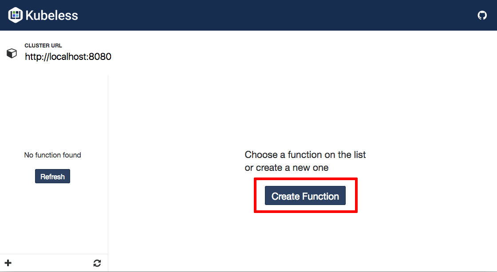
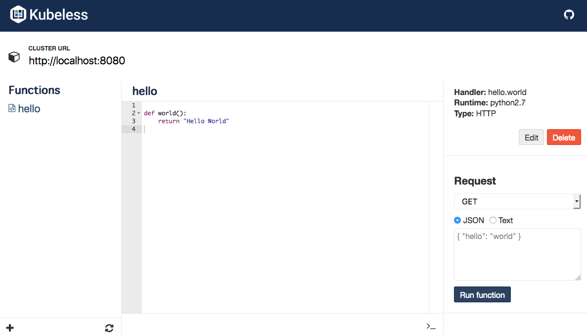

# Kubeapps Dashboard

Kubeapps comes with an in-cluster dashboard that offers a web UI to easily manage the deployments created by Helm in your cluster and to manage your Kubeless functions.

## Start the Dashboard

Securely access the Kubeapps Dashboard from your system by running:

```
kubeapps dashboard
```

This will start an HTTP proxy for secure access to the Kubeapps Dashboard and will launch your default browser to access it. Here's what you should see:


The following sections walk you through some common tasks with the Kubeapps Dashboard.

## Work with Charts

### Deploy new applications using the Dashboard

Once you have the Kubeapps Dashboard up and running, you can start deploying applications into your cluster.

* Start with the Dashboard welcome page:

  

* Use the "Charts" menu to select an application from the list of charts in the official Kubernetes chart repository. This example assumes you want to deploy MariaDB.

  

* Click the "Install" button. You will be prompted for the cluster namespace in which the application should be deployed.

  

* Click the "Deploy" button. The application will be deployed. You will be able to track the new Kubernetes deployment directly from the browser.

  

### List all the deployments managed by Helm

The "Deployments" menu displays a list of the deployments in the cluster that are managed by Helm.


### Remove existing deployments

You can remove any of the deployments that are managed by Helm by clicking the "Remove" button on a deployment detail page:


### Add more chart repositories

By default, Kubeapps comes with the official Kubernetes chart repositories enabled. You can see the list of enabled chart repositories in the "Repositories" menu:


Add new repositories (for example, your organization's chart repository) by clicking the "Add repository" button. Fill the "Add Repository" form using the guidelines below:

* Name: Use any unique identifier. Currently, only alphabetic characters are accepted.
* URL: Add the URL to the ```index.yaml``` file of the repository.
* Source: Add the URL to the source code for your charts. This field is optional.


## Work with Functions

The Kubeapps Dashboard includes a [Kubeless](https://kubeless.io) interface to be able to create, edit and run your Kubeless functions directly from your browser.

### Create a new function

To create a new Kubeless function from the Dashboard:

* Start with the "Functions" menu in the Dashboard.

  

* Click the "Create Function" button. 
* In the resulting modal dialog, select the runtime for the function, the name of the function object and the handler for the function:

  

* Click the "Create" button. The Kubeless interface will load a sample function, so you can easily modify it for your needs. Here's a simple "hello world" function example:

  

* Clicking "Run Function" will run the function using the selected runtime and will display the response. It may take some time to the function to complete execution.

For more examples of functions using different runtimes, check out the [examples in the Kubeless repository](https://github.com/kubeless/kubeless/tree/master/examples).